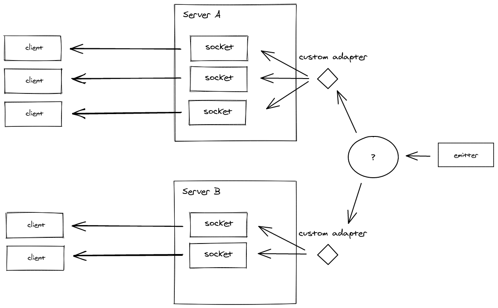

# Noom

Zoom Clone using NodeJS, WebRTC and Websockets

## About Adapter

: 다른 서버들 사이에 실시간 어플리케이션을 동기화하는 역할
 
브라우저는 서버로 하나의 connection 열어둠 -> 많은 브라우저들이 각각 한 서버에 connection 열게 됨 -> 서버에 많은 connection이 들어옴.
현재는 그들을 서버의 메모리에 저장하고 있음 -> 서버의 개수가 많아지면 같은 memory pool 공유 불가
 

이 그림에서 client들은 다른 서버, 같은 프론트엔드에 연결되어 있음. 서버 분리된 경우 adapter 사용하지 않을 시 서버 A에 있는 클라이언트 -> 서버 B에 있는 클라이언트 메시지 보내기 불가능. 그래서 실제로 큰 규모의 앱을 만들 때는 adapter 써야함. Adapter는 몽고DB 이용해서 서버 간의 통신을 해줌. 결국 A -> B 메시지 보내려면, 서버 A에서 adapter와 DB를 거쳐 다시 adapter로 가서 서버 B에 도착. 결과적으로 adapter는 어플리케이션으로 통하는 창문.

모든 socket은 private room을 가지고 있음.
adapter 객체의 sids에 private room들이 있고, rooms에 public + private room들이 있음.
즉, sids엔 없고 rooms에 있는 방이 public room.
